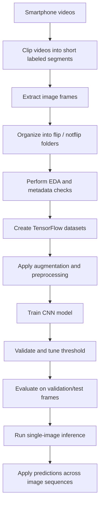

# MonReader: Page Flip Detection from Smartphone Images

A computer vision project that predicts whether a book or document page is being flipped from a **single image frame** extracted from smartphone video.

This repository demonstrates an end-to-end deep learning workflow for image classification, from exploratory data analysis and data pipeline creation to CNN training, threshold optimization, and sequence-level inference.

---

## Project Overview

**MonReader** tackles a practical computer vision problem: detecting page-flipping activity from images captured in short smartphone video clips.

The dataset contains frames extracted from labeled videos and organized into two classes:

- `flip`
- `notflip`

Each frame is stored using the naming convention:

`VideoID_FrameNumber`

### Business / Product Framing

This project can be positioned as a lightweight visual activity-recognition solution for applications such as:

- smart reading assistants
- document interaction monitoring
- digital learning analytics
- human-computer interaction systems
- mobile-based content engagement tracking

From a recruiter and hiring-manager perspective, this project highlights skills in:

- deep learning model development
- computer vision pipeline design
- exploratory data analysis
- model evaluation and threshold tuning
- production-minded experimentation in TensorFlow / Keras

---

## Problem Statement

Build a model that can:

1. **Predict whether a single image contains a page-flipping action**
2. Extend that logic to assess whether a **short sequence of frames** contains flipping activity

### Success Metric

The notebook defines **F1 score** as the primary performance metric, making this a strong choice for balancing precision and recall in binary classification. 

---

## Dataset Summary

The notebook reports:

- **2,392 training images**
- **597 test images**
- image size consistency across the dataset: **1080 × 1920**
- two classes: `flip` and `notflip`
- training and test sets are described as **not imbalanced** / reasonably balanced before modeling

For model training, images are resized to:

- **128 × 128**
- **batch size = 32**
- **epochs = 15**

---

## Repository Structure

```text
├── MonReader_model.ipynb     # End-to-end notebook: EDA, modeling, evaluation, inference
├── page_flip_cnn.keras       # Saved trained CNN model
├── requirements.txt          # Python dependencies
└── README.md                 # Project documentation
````

---

## Technical Approach

## 1) Exploratory Data Analysis

The notebook begins by:

* scanning the training and test image folders
* extracting metadata such as:

  * file path
  * filename
  * class label
  * video ID
  * frame number
  * width / height
  * image mode
  * file size
* checking class balance
* validating that all images share the same dimensions
* displaying sample images from both training and test sets

This step helps confirm that the dataset is clean and structurally consistent before training.

---

## 2) Data Pipeline

TensorFlow image datasets are created directly from directory structure using:

* training split
* validation split
* test dataset

### Split used in the notebook

* Training subset: **1,914 images**
* Validation subset: **478 images**
* Test set: **597 images**

This setup enables a clean training/validation/test workflow without manual label engineering.

---

## 3) Data Augmentation

To improve robustness and reduce overfitting, the project applies image augmentation during training:

* horizontal flip
* slight rotation
* slight zoom

This is a strong design choice for computer vision tasks where the model should generalize to small real-world variations in viewpoint and motion.

---

## 4) CNN Architecture

The project uses a custom Convolutional Neural Network built in Keras with the following high-level structure:

* Input layer: `128 x 128 x 3`
* Data augmentation
* Rescaling layer
* Convolution block: `Conv2D(32)` + max pooling
* Convolution block: `Conv2D(64)` + max pooling
* Convolution block: `Conv2D(128)` + max pooling
* Convolution block: `Conv2D(256)` + max pooling
* Flatten
* Dense layer: `256`
* Dropout: `0.2`
* Output layer: `1 sigmoid`

### Model size

* **Total parameters: 4,583,233**

This architecture is appropriate for learning spatial patterns from page images while remaining straightforward and interpretable.

---

## 5) Training Strategy

The model is compiled with:

* **Adam optimizer**
* **binary cross-entropy loss**
* metrics:

  * accuracy
  * precision
  * recall

The training loop includes production-aware callbacks:

* **EarlyStopping**
* **ReduceLROnPlateau**
* **ModelCheckpoint**

These choices help improve training stability, reduce overfitting risk, and preserve the best-performing model checkpoint.

---

## 6) Threshold Tuning

Instead of relying only on the default `0.5` classification cutoff, the notebook evaluates thresholds from:

* **0.10 to 0.90** in steps of **0.05**

The best threshold selected on the validation set is:

* **0.30**

This is a strong touch in the project because it shows awareness that classification quality depends not only on model probabilities, but also on choosing the right operating threshold for the business metric.

---

## Results

## Validation Set Performance

Using the tuned threshold of **0.30**, the notebook reports the following validation results:

### Classification Report

| Class   | Precision | Recall | F1-score | Support |
| ------- | --------- | ------ | -------- | ------- |
| notflip | 0.97      | 0.96   | 0.97     | 244     |
| flip    | 0.96      | 0.97   | 0.97     | 234     |

### Overall Metrics

* **Accuracy:** 0.97
* **Macro F1:** 0.97
* **Weighted F1:** 0.97

### Confusion Matrix

```text
[[235   9]
 [  7 227]]
```

These results indicate strong and balanced performance across both classes.

---

## Single-Image Inference Example

The notebook also demonstrates inference on an individual test image.

Example shown:

* predicted flip probability: **0.0127**
* predicted label: **notflip**
* true label: **notflip**

This confirms that the model can be used for direct frame-level prediction in an intuitive way.

---

## Sequence-Level Inference

To address the broader challenge of determining whether a **sequence of frames** contains a flipping action, the notebook evaluates a slice of 50 test images.

### Sequence Classification Report

| Class   | Precision | Recall | F1-score | Support |
| ------- | --------- | ------ | -------- | ------- |
| notflip | 0.97      | 0.97   | 0.97     | 32      |
| flip    | 0.94      | 0.94   | 0.94     | 18      |

### Overall Sequence Metrics

* **Accuracy:** 0.96
* **Macro F1:** 0.96
* **Weighted F1:** 0.96

### Sequence Confusion Matrix

```text
[[31  1]
 [ 1 17]]
```

This is a useful extension because it shows how a frame-level classifier can support sequence-level reasoning in practical applications.

---

## Visual Workflow



---

## Why This Project Stands Out

This repository demonstrates more than just model training. It shows an end-to-end machine learning workflow with attention to:

* dataset inspection before modeling
* robust TensorFlow input pipelines
* image augmentation
* CNN architecture design
* validation-based threshold optimization
* interpretable evaluation using precision, recall, F1, and confusion matrices
* extension from single-frame prediction to short-sequence analysis

---

## Tech Stack

* **Python**
* **TensorFlow / Keras**
* **NumPy**
* **Pandas**
* **Matplotlib**
* **Pillow**
* **scikit-learn**

---

## Installation

```bash
git clone https://github.com/ninad22dixit/g79M9mcShjAy2hEK.git
cd g79M9mcShjAy2hEK
pip install -r requirements.txt
```

---

## How to Run

Open the notebook and execute the workflow step by step:

```bash
jupyter notebook MonReader_model.ipynb
```

The notebook covers:

1. EDA and metadata extraction
2. dataset creation
3. augmentation and preprocessing
4. CNN training
5. threshold tuning
6. validation and sequence-level evaluation
7. sample inference

---

## Potential Future Improvements

A few natural next steps for extending the project would be:

* using transfer learning with pretrained CNN backbones such as EfficientNet or MobileNet
* modeling full temporal behavior with CNN + LSTM or 3D CNN approaches
* adding Grad-CAM visualizations for explainability
* packaging the model into a lightweight inference app or API
* benchmarking latency for mobile or edge deployment

---
